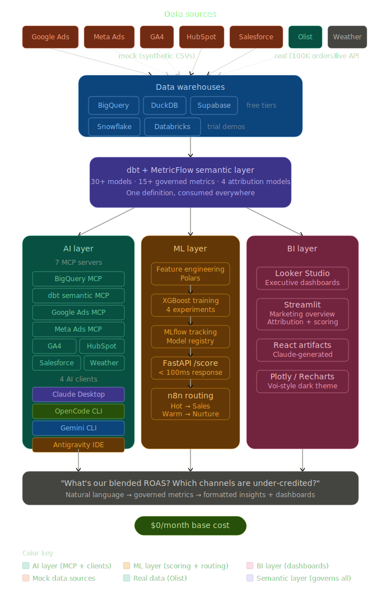

# Full-Funnel AI Marketing Analytics Platform


**Natural language marketing analytics powered by MCP, dbt Semantic Layer, and ML lead scoring. Works with Claude Desktop, OpenCode, Gemini CLI, and Antigravity IDE.**

> *"Which channels actually drive revenue, not just clicks?"*<br>
> This system answers that question in 15 seconds via natural language — backed by multi-touch attribution, a production ML scoring API, and dashboards fed from a single governed semantic layer running across 5 data warehouses.

---

## Ask your data and get real-time answers

Ask Claude or other supported LLMs *any question about your data* and get **real-time insights and dashboards** — integrated with your data warehouses, CRMs, and Ads platforms.

> Predefined commands: type `/marketing` and see the magic happens:


**[▶ Watch the video →](demo/videos/marketing-query.mp4)**

> View the dashboards for all commands available: <br>
> [[/marketing]](dashboards/full_funnel_marketing_dashboard.html) | [[/attribution]](dashboards/attribution_dashboard.html) | [[/campaign]](dashboards/campaign_performance_dashboard.html) | [[/pipeline]](dashboards/pipeline_dashboard.html) | [[/traffic]](dashboards/traffic_ga4_dashboard.html);

---

## Demo

### Hero Query

> *"Show me the complete marketing funnel for Q1 2025: ad spend across Google and Meta, website sessions by channel, lead conversion rates, and final revenue. Calculate blended CAC and ROAS."*

The AI queries the dbt semantic layer via MCP, pulls GA4 traffic and CRM pipeline data from mock platform servers, and returns a formatted analysis with KPI cards, charts, and recommendations — in ~15 seconds. Works from Claude Desktop, OpenCode, Gemini CLI, or Antigravity IDE.


**[▶ Watch the demo video →](demo/videos/open-query.mp4)**

### Other queries this system handles

- *"Compare first-touch vs last-touch attribution for our top channels"*
- *"Score this lead: came from Google Ads, visited 5 pages, 3 min on site"*
- *"Which product categories have the highest CAC but lowest LTV?"*
- *"What should we change about our ad spend next quarter?"*

---

## Who This Is Built For

| Role                              | What they see                                                                    |
| --------------------------------- | -------------------------------------------------------------------------------- |
| **Paid Media / Growth Analytics** | Multi-touch attribution (4 models), ROAS by channel, spend optimization          |
| **RevOps Analyst**                | Full-funnel pipeline, CRM integration, lead routing automation                   |
| **Data Scientist**                | XGBoost lead scoring, MLflow experiment tracking, FastAPI deployment             |
| **Analytics Engineer**            | dbt semantic layer, MCP architecture, multi-warehouse + multi-client portability |
| **BI / Data Analyst**             | Looker Studio dashboards, Streamlit app, React artifacts                         |
| **Marketing Analyst**             | CAC/LTV analysis, channel comparison, attribution model comparison               |

---

## The Problem

Companies run ads across Google, Meta, and organic channels. Marketing claims leads. Sales says they're low quality. The CEO asks: *"Where should we spend next quarter?"*

Answering this requires joining data from 5+ platforms, building attribution models, scoring leads, and making it all accessible to non-technical stakeholders. Most teams cobble together spreadsheets and one-off queries. This project builds the production system — at $0/month base cost.

---

## The Core Insight: Governance is What Makes AI Analytics Reliable

Most AI-to-SQL tools fail because they lack a **source of truth.** When an AI writes SQL on behalf of a marketing manager who can't verify it, you need guaranteed correctness.

This project solves that with the **dbt Semantic Layer (MetricFlow)**: define "ROAS" once in YAML, and every AI client, dashboard, and ML pipeline consumes the exact same definition — `SUM(attributed_revenue) / SUM(ad_spend)` with the correct filters and joins, forever.

> According to [The 2025 Metabase Community Data Stack Report](https://www.metabase.com/data-stack-report-2025):
> *"Average confidence in AI-generated queries is just **5.5/10** without a semantic layer. Tools like dbt MCP (60+ tools) now provide production-grade MCP servers that give LLMs deterministic metric definitions, reducing hallucination and enforcing governance across platforms like Snowflake and Databricks."*
>
> **This project implements exactly that architecture** — moving from 5.5/10 confidence to deterministic, production-grade certainty.

---

## What This Project Does

### Architecture: Three Heads, One Spine

> Full-stack analytics portfolio — data ingestion through AI-powered natural language querying, built entirely on free/trial tiers.



| Pillar       | What it does                                               | Tech                                                              |
| ------------ | ---------------------------------------------------------- | ----------------------------------------------------------------- |
| **AI Layer** | Query marketing data in plain English, generate dashboards | 7 MCP servers + Claude Desktop, OpenCode, Gemini CLI, Antigravity |
| **ML Layer** | Predict which leads become high-value customers            | XGBoost + MLflow + FastAPI `/score` + n8n auto-routing            |
| **BI Layer** | Self-serve dashboards for marketing and sales teams        | Looker Studio + Streamlit + Claude React artifacts                |

---

## Build Status

| Phase                            | Status     | Description                                                  |
| -------------------------------- | ---------- | ------------------------------------------------------------ |
| Phase 1: Data Foundation         | ✅ Complete | Olist dataset + synthetic marketing data + warehouse loading |
| Phase 2: dbt Semantic Layer      | ✅ Complete | 14 staging + 4 intermediate + 11 mart models                 |
| Phase 3: AI Layer (MCP)          | ✅ Complete | 7 MCP servers + 4 AI client configs                          |
| Phase 4: ML Scoring              | ✅ Complete | XGBoost + MLflow + FastAPI endpoint                          |
| Phase 5: Dashboards & Automation | ✅ Complete | Looker Studio + Streamlit + n8n routing                      |
| Phase 6: Portability & Polish    | ✅ Complete | Snowflake/Databricks demos + documentation                   |

### Project Scale

| Component            | Detail                                                             |
| :------------------- | :----------------------------------------------------------------- |
| **Data Volume**      | 23 CSV files, **2.2M+ rows**, aligned across 2024–2026             |
| **DuckDB Warehouse** | **46 objects** (staging views + mart tables), all populated        |
| **dbt Models**       | **29 models**, all materialized, end-to-end verified               |
| **MCP Servers**      | **7 servers**, column references cross-checked against source CSVs |
| **Streamlit App**    | 5 tabs, all DuckDB queries valid, AI analyst integrated            |
| **ML Pipeline**      | XGBoost trained on **93K rows**, FastAPI `/score` endpoint live    |
| **Semantic Layer**   | **5 semantic models** + **13+ metrics** governed                   |
| **Dependencies**     | **27 core packages**, all importable                               |

---

## MCP Servers

| Server                 | What it exposes                   | Key tools                                                                     |
| ---------------------- | --------------------------------- | ----------------------------------------------------------------------------- |
| **BigQuery**           | Warehouse queries                 | `execute_query`, `list_tables`, `get_schema`                                  |
| **dbt Semantic Layer** | Governed metrics + SQL generation | `text_to_sql`, `get_metrics`, `get_dimensions` (60+ tools)                    |
| **Google Ads**         | Campaign performance, keywords    | `get_campaign_performance`, `get_keyword_performance`, `list_campaigns`       |
| **Meta Ads**           | Ad sets, reach, purchases         | `get_campaign_insights`, `get_ad_set_breakdown`, `list_campaigns`             |
| **GA4**                | Sessions, channels, conversions   | `get_traffic_by_channel`, `get_daily_trend`, `get_device_breakdown`           |
| **HubSpot**            | Contacts, deals, pipeline         | `get_contacts_by_source`, `get_deal_pipeline`, `search_contacts`              |
| **Salesforce**         | Opportunities, accounts, revenue  | `get_opportunity_pipeline`, `get_revenue_by_source`, `get_quarterly_forecast` |

> All mock servers use the exact same tool interface as real platform APIs. Swap mock → production with zero code changes.

---

## AI Clients

| Client              | MCP Support        | Unique Strength                                              | Cost              |
| ------------------- | ------------------ | ------------------------------------------------------------ | ----------------- |
| **Claude Desktop**  | Native (best)      | Cowork plugin, React artifact rendering, multi-tool chaining | $20/mo (optional) |
| **OpenCode**        | Native             | 75+ models (Claude, Gemini, GPT, Llama, local), open source  | Free + API costs  |
| **Gemini CLI**      | Native             | Native BigQuery integration, free generous rate limits       | Free              |
| **Antigravity IDE** | Native (MCP Store) | Manager View with parallel agents, VS Code fork              | Free (preview)    |

> The same 7 MCP servers work with ALL 4 clients. No code changes between clients.

---

## AI-Powered Commands

Type these in Claude Code CLI or Antigravity to generate a deep-dive analysis artifact:

| Command        | What it does                                                 |
| :------------- | :----------------------------------------------------------- |
| `/marketing`   | Full exec dashboard — KPIs, spend, funnel, pipeline          |
| `/attribution` | Channel attribution deep-dive — scatter, waterfall, insights |
| `/pipeline`    | Sales pipeline — funnel stages, deal velocity, lifecycle     |
| `/campaign`    | Paid campaign performance — Google vs Meta, budget pacing    |
| `/traffic`     | GA4 traffic — sessions trend, channel breakdown, anomalies   |

Commands live in `.claude/commands/` (Claude CLI) and `.opencode/commands/` (OpenCode). Same logic, both formats. You can add your own commands as well.

### Claude Desktop

Since Claude Desktop doesn't support command files, use **Projects**:
1. Open Claude Desktop → **Projects** → **New Project**
2. Paste [`claude_desktop_project_instructions.md`](docs/guides/claude_desktop_project_instructions.md) into **Project Instructions**
3. Use natural language instead of slash commands:

| CLI Command    | Claude Desktop Equivalent     |
| :------------- | :---------------------------- |
| `/marketing`   | "marketing dashboard"         |
| `/attribution` | "which channels are working?" |
| `/traffic`     | "show me sessions"            |
| `/campaign`    | "google vs meta performance"  |
| `/pipeline`    | "show me deals"               |

---

## Metrics Governed by the Semantic Layer

| Metric              | Definition                                        | Category    |
| ------------------- | ------------------------------------------------- | ----------- |
| Blended CAC         | Total ad spend / New customers                    | Marketing   |
| Blended ROAS        | Attributed revenue / Total ad spend               | Marketing   |
| Channel ROAS        | Revenue (per attribution model) / Channel spend   | Attribution |
| First-Touch Revenue | Revenue credited to first interaction             | Attribution |
| Last-Touch Revenue  | Revenue credited to last interaction              | Attribution |
| Linear Revenue      | Revenue split equally across touchpoints          | Attribution |
| AOV                 | Total revenue / Total orders                      | Revenue     |
| Customer LTV        | Predicted lifetime revenue per customer           | Revenue     |
| Lead Score          | ML-predicted probability of high-value conversion | Scoring     |
| Pipeline Velocity   | Weighted pipeline value / Days in period          | Pipeline    |
| Win Rate            | Closed Won / (Closed Won + Closed Lost)           | Pipeline    |
| Conversion Rate     | Conversions / Sessions                            | Website     |

---

## Stack & Cost

**Total base cost: $0/month.** Claude Pro ($20/mo) optional for Cowork plugin + React artifacts.

| Component           | Tool                     | Cost                               |
| ------------------- | ------------------------ | ---------------------------------- |
| Primary Warehouse   | BigQuery                 | $0 — 10GB + 1TB queries/month free |
| Local Dev           | DuckDB                   | $0 — open source                   |
| Postgres Demo       | Supabase                 | $0 — 500MB free                    |
| Semantic Layer      | dbt Core + MetricFlow    | $0 — open source                   |
| ML Tracking         | MLflow                   | $0 — open source, self-hosted      |
| Scoring API         | FastAPI                  | $0 — open source                   |
| Automation          | n8n                      | $0 — self-hosted                   |
| BI Dashboards       | Looker Studio            | $0 — free with Google              |
| Interactive App     | Streamlit                | $0 — community cloud               |
| Weather API         | Open-Meteo               | $0 — no key needed                 |
| MCP Servers         | Open source              | $0                                 |
| AI: Claude Desktop  | Cowork + React artifacts | $20/month (optional)               |
| AI: OpenCode        | Terminal + 75 models     | $0 (free + API costs)              |
| AI: Gemini CLI      | BigQuery native          | $0 (free generous limits)          |
| AI: Antigravity IDE | Parallel agents          | $0 (free public preview)           |

Enterprise warehouse demos use free trials: Snowflake (30-day, ~$400 credits) and Databricks (14-day).

---

## Quick Start

See the [Step-by-Step Setup Guide](SETUP_GUIDE.md) for full instructions.

```bash
# 1. Clone
git clone https://github.com/YOUR_USERNAME/full-funnel-ai-analytics.git
cd full-funnel-ai-analytics

# 2. Setup
python -m venv .venv && source .venv/bin/activate
pip install -r requirements.txt
cp .env.example .env  # Fill in your credentials

# 3. Download and generate data
python scripts/download_olist_data.py
python scripts/generate_mock_marketing_data.py

# 4. Load into warehouses
python scripts/load_bigquery.py
python scripts/load_duckdb.py

# 5. Build dbt models
cd dbt_project && dbt build --target bigquery && cd ..

# 6. Start ML tracking and train model
bash scripts/run_mlflow_server.sh &
python ml/src/train.py

# 7. Start scoring API
cd api && uvicorn main:app --port 8000 &

# 8. Configure MCP for your preferred client
# Claude Desktop: copy mcp_servers/claude_desktop_config.example.json
#                 to ~/Library/Application Support/Claude/claude_desktop_config.json
# OpenCode: already configured at .opencode/opencode.json — run `opencode`
# Gemini CLI: gemini --mcp-server "bigquery=uvx mcp-server-bigquery --project YOUR_PROJECT"

# 9. Query in natural language from any client:
# "Show me blended ROAS across Google and Meta for Q1 2025,
#  with attribution model comparison and lead quality breakdown."
```

---

## Project Structure

```
full-funnel-ai-analytics/
├── dbt_project/                    # Semantic layer + transformations
│   ├── models/
│   │   ├── staging/                #   14 staging models (Olist + marketing)
│   │   ├── intermediate/           #   4 intermediate (LTV, funnel, unified campaigns)
│   │   ├── marts/                  #   11 mart models (facts + dimensions)
│   │   ├── semantic_models/        #   MetricFlow definitions
│   │   └── metrics/                #   15+ governed metrics
│   └── macros/                     #   Attribution model logic + cross-db helpers
│
├── mcp_servers/                    # 7 MCP servers (work with all 4 clients)
│   ├── mock_google_ads_server.py
│   ├── mock_meta_ads_server.py
│   ├── mock_ga4_server.py
│   ├── mock_hubspot_server.py
│   ├── mock_salesforce_server.py
│   └── weather_server.py
│
├── cowork_plugin/                  # Claude Desktop Cowork plugin
│   ├── commands/                   #   /marketing, /attribution, /pipeline, /score
│   └── skills/                     #   Brand voice, metric definitions, workflows
│
├── .opencode/                      # OpenCode CLI config + commands + skills
│   ├── opencode.json               #   MCP server config
│   ├── commands/                   #   Same commands (OpenCode format)
│   └── skills/
│
├── ml/                             # Lead scoring ML pipeline
│   ├── src/train.py                #   XGBoost + MLflow tracking
│   └── notebooks/                  #   EDA, training, evaluation
│
├── api/                            # FastAPI lead scoring endpoint
│   ├── main.py                     #   POST /score, GET /health, GET /model-info
│   └── Dockerfile
│
├── automation/                     # n8n lead routing workflow
│   └── n8n_workflow.json
│
├── streamlit_app/                  # Interactive AI dashboard
│   └── app.py
│
├── scripts/                        # Data download + loading
│
├── warehouse_configs/              # Setup scripts per warehouse
│   ├── bigquery/
│   ├── snowflake/
│   ├── databricks/
│   ├── supabase/
│   └── duckdb/
│
└── docs/                           # Architecture, cost analysis, guides
```

---

## Key Design Decisions

### Why MCP instead of LangChain?

MCP is an open standard (Linux Foundation) for AI tool calling — it eliminates the middleware layer. The result: simpler code, fewer dependencies, and a direct connection between any LLM and any data source. Unlike LangChain, which ties you to its abstraction layer, MCP servers work with Claude Desktop, OpenCode, Gemini CLI, Antigravity, Cursor, and any future MCP-compatible client.

### Why mock MCP servers?

The mock servers expose the **exact same tool interface** as real platform APIs. When you swap mock → production, all client configurations, commands, and dashboards work without code changes. This proves the MCP abstraction layer works — and that the system is vendor-agnostic and LLM-agnostic.

### Why MetricFlow?

When AI writes SQL on behalf of someone who can't verify it, you need guaranteed correctness. MetricFlow ensures "ROAS" always means the same thing — defined once in YAML, consumed everywhere: AI queries, BI dashboards, ML features.

### Why 5 warehouses?

Not because you'd run 5 in production — but because it proves the semantic layer is truly warehouse-agnostic. Same dbt models, same metrics, same MCP interface, different execution engine. This directly answers *"but we use Snowflake"* — you show it working on Snowflake.

### Why 4 AI clients?

Same principle — it proves the MCP architecture is LLM-agnostic. This directly answers *"but we use GPT-4"* — you show the same servers working with any client.

---

## Swapping to Real Platform Data

| Mock Server                 | Production Replacement      | Setup                                  |
| --------------------------- | --------------------------- | -------------------------------------- |
| `mock_google_ads_server.py` | `cohnen/mcp-google-ads`     | Google Ads API developer token + OAuth |
| `mock_meta_ads_server.py`   | `meta-ads-mcp-server` (npx) | Meta access token with ads_read        |
| `mock_ga4_server.py`        | GrowthSpree GA4 MCP         | Google OAuth                           |
| `mock_hubspot_server.py`    | Official HubSpot MCP        | HubSpot access token                   |
| `mock_salesforce_server.py` | Airbyte agent connector     | Salesforce Connected App               |

---

## Multi-Warehouse Portability

The entire stack is warehouse-agnostic. Only connection config changes between warehouses — all dbt models, MetricFlow definitions, MCP interfaces, client commands, and dashboards stay identical.

| What stays the same                         | What changes                                               |
| ------------------------------------------- | ---------------------------------------------------------- |
| All dbt model SQL (Jinja handles dialects)  | `~/.dbt/profiles.yml` connection details                   |
| All MetricFlow semantic models and metrics  | One MCP binary/config per warehouse                        |
| All MCP server tool interfaces              | Minor SQL dialect differences (auto-handled by dbt macros) |
| All client commands, skills, and dashboards |                                                            |

See the [Portability Guide](docs/portability_guide.md) for Snowflake, Databricks, and Supabase setup steps.

---

## Built With

**Data:** Olist Brazilian E-Commerce Dataset (Kaggle) + Synthetic Marketing Data

**Warehouses:** BigQuery · DuckDB · Supabase · Snowflake · Databricks

**Transformation:** dbt Core · MetricFlow · Polars

**AI Clients:** Claude Desktop · OpenCode · Gemini CLI · Antigravity IDE

**AI/MCP:** Model Context Protocol · Anthropic API · Cowork Plugin · OpenCode Commands

**ML:** XGBoost · Scikit-learn · MLflow · FastAPI

**Automation:** n8n

**Visualization:** Looker Studio · Streamlit · Plotly · Recharts

**Infrastructure:** Docker · uv · GitHub Actions

---

## Documentation

| Document | Description |
| -------- | ----------- |
| [Architecture Flow](docs/images/full_funnel_architecture_flow.svg) | System design & data flow diagrams |
| [Setup & Execution Guide](docs/guides/setup_guide.md) | Step-by-step instructions to get the full platform running locally |
| [Analytical Commands Guide](docs/guides/commands_guide.md) | Reference for all slash commands (`/marketing`, `/campaign`, `/attribution`, etc.) |
| [Multi-Warehouse Portability Guide](docs/guides/portability_guide.md) | Deploying to Snowflake or Databricks from the default BigQuery/DuckDB setup |
| [BigQuery Data Warehouse Plan](docs/guides/data-warehouse-plan.md) | BigQuery implementation plan and data warehouse architecture decisions |
| [Claude Desktop Project Instructions](docs/guides/claude_desktop_project_instructions.md) | Configuring Claude Desktop Projects to use the analytical commands |

---

## Contributing

Contributions are welcome! This project is part of a portfolio demonstrating end-to-end Revenue Operations engineering capabilities.

1. Fork the repository
2. Create your feature branch (`git checkout -b feature/amazing-feature`)
3. Commit your changes (`git commit -m 'Add amazing feature'`)
4. Push to the branch (`git push origin feature/amazing-feature`)
5. Open a Pull Request

---

## License

MIT License — see [LICENSE](LICENSE) for details.

---

<p align="center">
  <sub>Built with ☕ by <strong><a href="https://www.linkedin.com/in/eduardo-cornelsen/">Eduardo Cornelsen</a></strong> — © 2026 All Rights Reserved</sub><br/>
  <sub>Portfolio project demonstrating production-grade data analytics architecture with AI integration.</sub><br/>
  <sub>Revenue Operations · Data Engineering · AI/ML · Full-Stack Development</sub>
</p>